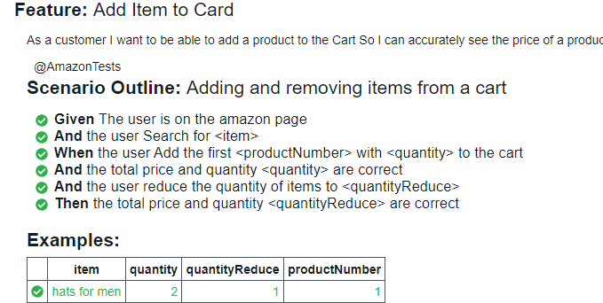

# Selenium Cucumber and Java, Automation Tool
A Behavior Driven Development framework which uses Page Object Model and Singleton design pattern

## Getting Started
* Install Java(7 or 8) & Maven on your local machine

1. Resolve all dependencies within the project with Maven
2. You can run the test through the IDE in the testRunner file
   which will run the test with `@RunWith (Cucumber.class)` and setup for cucumber
3. Run test through the command line using cucumber tags 
   `mvn test -Dtags=@AmazonTests`

**Note**: The report will be generated in any case after Run the test

### Reports
At the end of each execution you will find a report, If you click on the link you will be redirect
to see the report online, Which will last for 24 hours, as in the following image 

* Into target folder you will find the cucumber-html-report Which is a html local report generated at the end
of each execution
[target/cucumber-html-report/report.html
](target/cucumber-html-report/report.html)

* and Finally a Json Cucumber Report is created in order to use Cucumber Report for Jenkins or any CI tool 
[target/cucumber-reports/cucumber.json](target/cucumber-reports/cucumber.json)

#### About the Project Structure
##### Page Object Manager
The purpose of the Page Object Manager is to create the page object and ensure that the same
object is not created over and over again.
##### Driver Manager
this concept allows us to easily change the browser we want
##### File Reade 
to implement Data Driven Testing if needed
##### Utilities and Enums
Utilities and enums as a good practice to storage variables and reusing common methods

- Assertions have been handled with hamcrest for java
- Tests are running against ** Chrome **